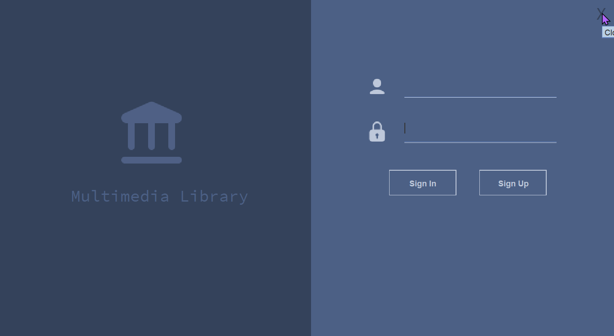
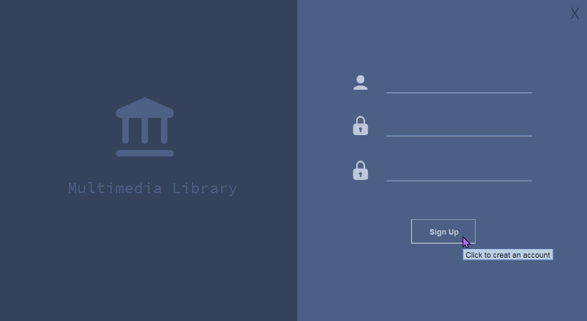
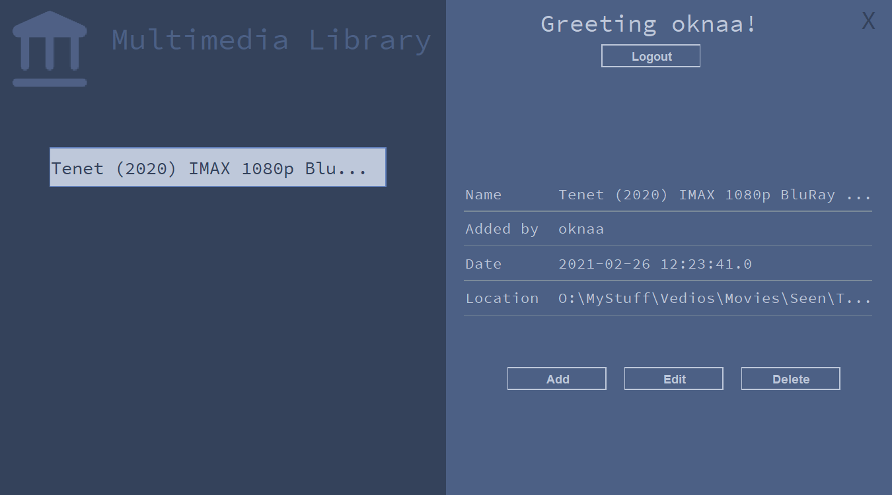
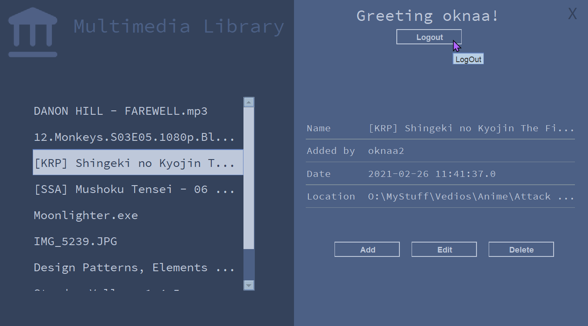

# Multimedia_Library
This program is for storing and organizing files withing a Database;

### Program description:
At first, the user has to `Sign In` to the system;

Or `Sign UP`

Then, the user can add files to the Database, by pressing the `Add` button, and see them showing in the list to the Left

- By pressing the `Edit` button, The user can also Rename the added files, both in the list,
and the actual file in the machine.
   
- And the `Delete` button lets the user delete the file, both the entry in the list, and the actual file in the machine.

After the user finishs, he can press `Logout` to exit his session, and go back to the login menu

